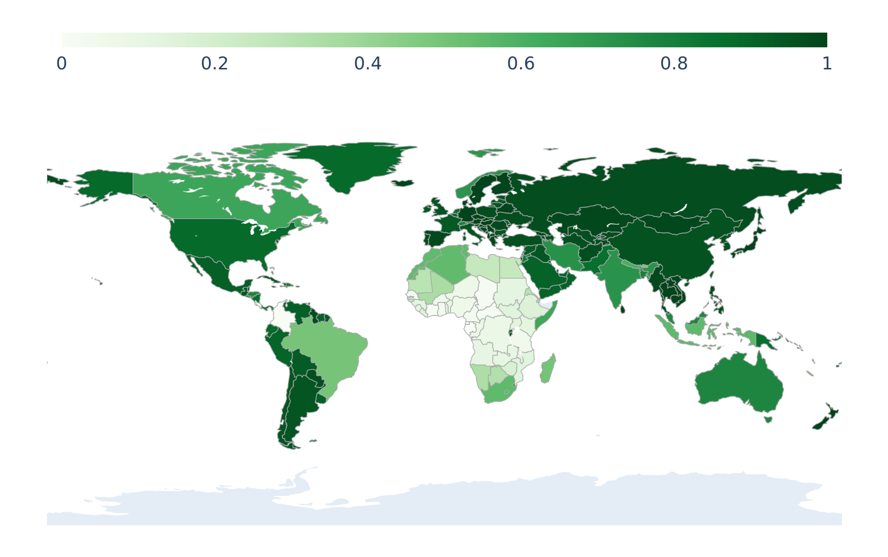
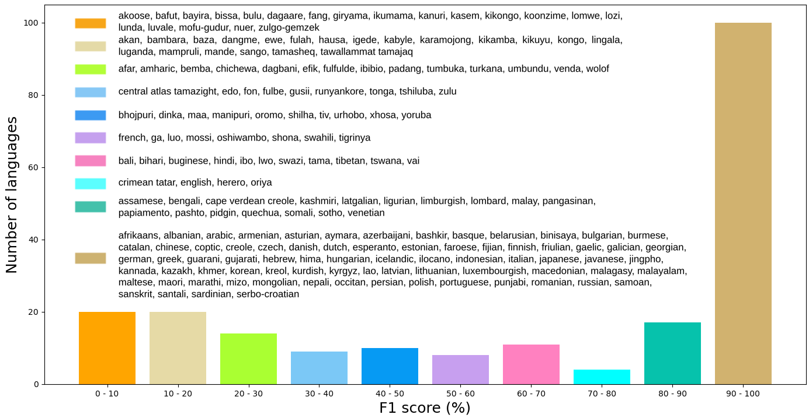
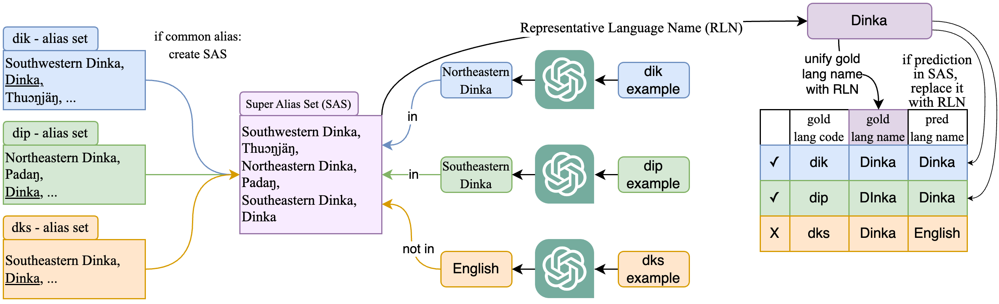
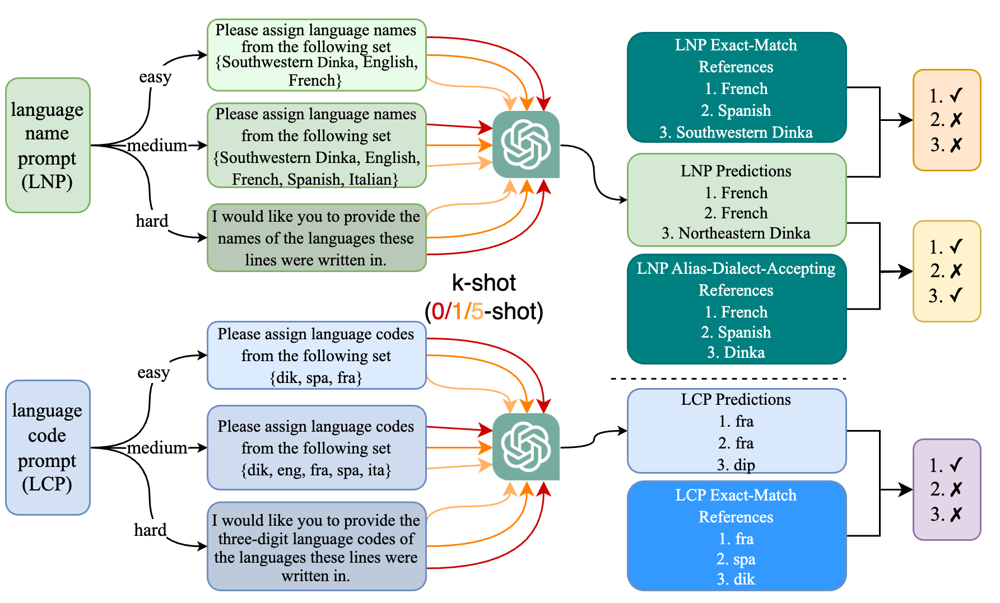

# Babel-670 Language Identification

# 🤔 What and how many languages does ChatGPT know?

We approach the research question **What and how many languages does ChatGPT 'know'?** by evaluating the language identification ability of ChatGPT (both GPT-4/GPT-3.5). Our work [Fumbling in Babel: An Investigation into ChatGPT's Language Identification Ability](https://aclanthology.org/2024.findings-naacl.274.pdf) has been accepted to [NAACL2024](https://2024.naacl.org/). In this repo, we provide the slides and poster of our project and the slides for an introduction to popular language identification tools.

### ✅ A geographical analysis shows that ChatGPT is least capable of identifying African languages.

### ✅ ChatGPT is able to identify 100 languages nearly perfectly (>90% F1), but has zero capabilities at identifying 384 languages (0% F1).

### ✅ We propose a novel fuzzy evaluation method which accepts aliases (e.g. Spanish and Español) and dialects (e.g. Southwestern Dinka and Northeastern Dinka).

For more details, please refer to our paper at [ACL Anthology](https://aclanthology.org/2024.findings-naacl.274/) for our analysis on the following aspects:

### 💡 Methodology: We ask ChatGPT to predict language name and language code for 670 languages, given 0/1/5-shots, with and without a label set as a hint.

### 📊 Error analysis: ChatGPT has only 76% and 56% F1 for English and French?

### 📝 Script-wise analysis: More languages written in a script, the harder for these languages to be correctly identified?

### 🏆 A comparison of ChatGPT versus many other language identification tools (AfroLID, CLD2, CLD3, FastText, Franc, LangDetect, Langid.py)

We build a language identification model that is able to achieve ~95% test accuracy on 670 languages and we are happy to demo upon request.

Gratitude to all the collaborators: Prof. Muhammad Abdul-Mageed, Ife Adebara, Khai Doan, Qisheng Liao. I am grateful to all my lab colleagues for their insightful suggestions. This project is supported by [I Trust AI](https://interparestrustai.org/).